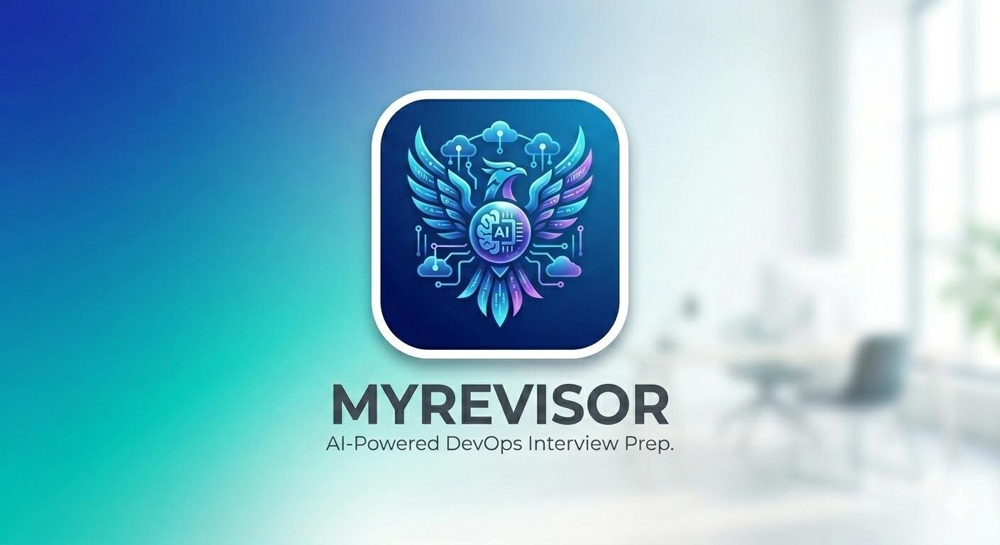

# MyRevisor



**DevOps Interview Study Application** - Master your Kubernetes, AWS, Docker, Jenkins, Git, Linux, and Shell Scripting knowledge through interactive study modes and quizzes.

[](https://badge.fury.io/js/myrevisor)
[](https://opensource.org/licenses/MIT)
[](https://myrevisor.vercel.app)

## Logo


## Live Demo

Try the web application live: **https://myrevisor.vercel.app**

The web app features:

- Study Mode with flashcards
- Quiz Mode with MCQ testing
- AI Chatbot support (bring your own OpenRouter API key)
- Progress tracking
- PWA support (install as app)

## Quick Install

```bash
npm install -g myrevisor
```

## Usage

After installation, you get **both CLI and Web** in one package!

### Launch Web App

```bash
myrevisor web
```

This opens the beautiful web interface in your browser with:

- Study Mode with flashcards
- Quiz Mode with MCQ testing
- AI Chatbot support
- Progress tracking
- PWA support (install as app)

### CLI Commands

| Command                            | Description                      |
| ---------------------------------- | -------------------------------- |
| `myrevisor` or `myrevisor study`   | Start interactive study mode     |
| `myrevisor test [subject]`         | Start quiz mode                  |
| `myrevisor test --timed [subject]` | Timed quiz (30 seconds/question) |
| `myrevisor test --mcq [subject]`   | Multiple choice quiz             |
| `myrevisor scores`                 | View your score history          |
| `myrevisor list`                   | List all available subjects      |
| `myrevisor reset`                  | Reset all scores                 |
| `myrevisor sync`                   | Sync latest data from GitHub     |
| `myrevisor update`                 | Alias for sync                   |
| `myrevisor help`                   | Show help information            |
| `myrevisor web`                    | Launch the web application       |

### Options

| Option                 | Description                           |
| ---------------------- | ------------------------------------- |
| `-n, --number <count>` | Number of questions to answer         |
| `-t, --timed`          | Enable timed mode (30s per question)  |
| `-m, --mcq`            | Multiple choice questions             |
| `-f, --force`          | Force sync all files (with sync cmd)  |
| `-s, --subject`        | Sync specific subject (with sync cmd) |
| `-h, --help`           | Show help information                 |
| `-v, --version`        | Show version number                   |

### Sync Command

Keep your question database up to date:

```bash
myrevisor sync          # Check for updates
myrevisor sync --force  # Force sync all files
myrevisor sync -s aws   # Sync specific subject
myrevisor update        # Alias for sync
```

### Examples

```bash
# Launch the web app (recommended)
myrevisor web

# Or use CLI directly
myrevisor study kubernetes
myrevisor test aws --timed --number 10
myrevisor test docker --mcq
myrevisor scores
myrevisor list
myrevisor sync
```

---

## Available Subjects (770+ Questions)

| Subject    | Questions | Description                             |
| ---------- | --------- | --------------------------------------- |
| kubernetes | 110       | Container orchestration and management  |
| docker     | 100       | Container technology and best practices |
| aws        | 130       | Amazon Web Services cloud platform      |
| jenkins    | 110       | CI/CD automation and pipelines          |
| git        | 110       | Version control system fundamentals     |
| linux      | 110       | Linux administration and commands       |
| shell      | 100       | Bash scripting and command line         |

---

## Web Application Features

When you run `myrevisor web`:

- **Dashboard** - Overview with progress cards for each subject
- **Study Mode** - Flashcard-style review with keyboard shortcuts (Space to reveal, K for Known, R for Review)
- **Quiz Mode** - MCQ testing with immediate feedback
- **AI Chatbot** - Ask questions using OpenRouter API (bring your own key)
- **Progress Tracking** - Track known/review questions per subject
- **PWA Support** - Install as an app on your device for offline use

### Web Routes

| Route               | Description                  |
| ------------------- | ---------------------------- |
| `/`                 | Dashboard with subject cards |
| `/study/:subjectId` | Study mode for a subject     |
| `/quiz`             | Quiz configuration           |
| `/chat`             | AI chatbot                   |
| `/progress`         | Progress and statistics      |
| `/settings`         | App settings                 |
| `/about`            | About page                   |
| `/terms`            | Terms & Conditions           |
| `/copyright`        | Copyright info               |

---

## Development

### Prerequisites

- Node.js >= 18.0.0
- npm or yarn

### Setup

```bash
# Clone the repository
git clone https://github.com/ashwani983/myrevisor.git
cd myrevisor

# Install root dependencies (CLI)
npm install

# Build the web app
npm run build
```

### Development Commands

```bash
# Run CLI
npm start

# Launch web app
npm run web

# Build web app
npm run build:web

# Lint code
npm run lint

# Format code
npm run format
```

### Project Structure

```
myrevisor/
├── bin/
│   └── myrevisor.js      # CLI entry point
├── src/
│   ├── app.js            # Main CLI app
│   ├── commands/         # CLI commands
│   │   ├── study.js
│   │   ├── test.js
│   │   ├── scores.js
│   │   ├── list.js
│   │   ├── reset.js
│   │   ├── help.js
│   │   ├── sync.js       # Data sync command
│   │   └── web.js        # Web server command
│   ├── config/
│   ├── data/             # Question databases (JSON)
│   │   ├── aws.json
│   │   ├── docker.json
│   │   ├── git-github.json
│   │   ├── jenkins.json
│   │   ├── kubernetes.json
│   │   ├── linux.json
│   │   ├── shell-scripting.json
│   │   └── versions.json  # Version tracking
│   └── utils/
├── web/                   # Web application (React + TypeScript)
│   ├── src/
│   └── public/
├── dist/                  # Built web app (generated)
├── docs/
├── package.json
└── README.md
```

---

## Configuration

### CLI App

Scores and settings are stored in:

- **macOS**: `~/.config/myrevisor/`
- **Linux**: `~/.config/myrevisor/`
- **Windows**: `%APPDATA%/myrevisor/`

### Web App

Data is stored in your browser's localStorage:

- Progress (known/review questions)
- Settings
- Quiz history
- Chat conversations

---

## License

MIT

---

## Links

- **Live Demo**: https://myrevisor.vercel.app
- **GitHub**: https://github.com/ashwani983/myrevisor
- **NPM Package**: https://www.npmjs.com/package/myrevisor
- **Developer**: https://github.com/ashwani983
